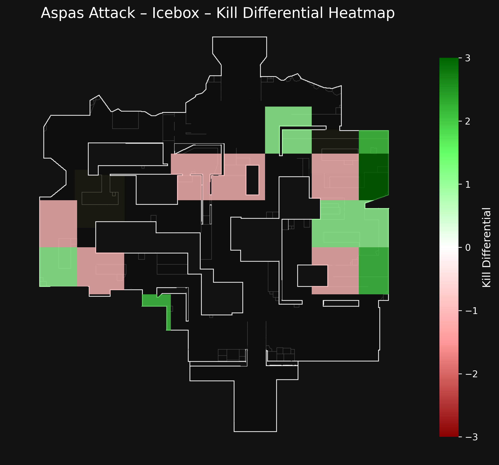
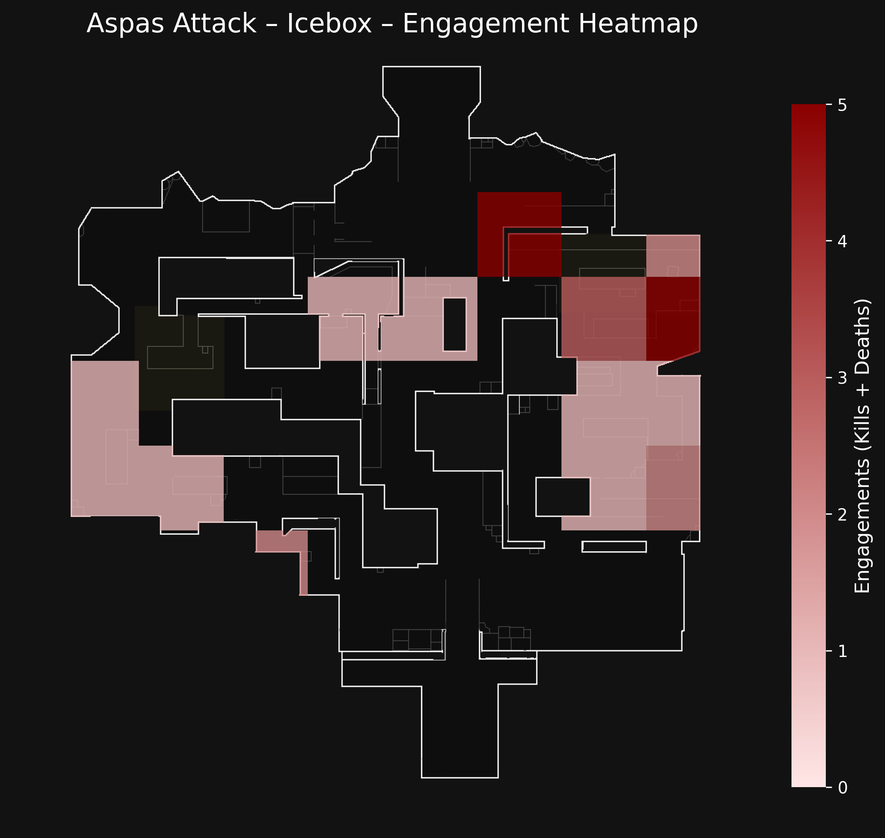

# 🗺️ Valorgrids: Tactical Heatmaps for Valorant

**Valorgrids** is a Python-based tool that creates **grid-based heatmaps** on Valorant maps, visualizing **Kill Differential** and **Engagements** (Kills + Deaths) per zone. This helps coaches, analysts, and players spot tactical patterns across maps like Haven, Icebox, and more.

---

## ✨ Features

- 📊 Kill Differential Heatmap: Visualizes kill vs. death balance on each grid square.
- 🔴 Engagement Heatmap: Highlights zones with the most fights (Kills + Deaths combined).
- 🖼️ Custom map backgrounds (e.g., Haven, Icebox).
- 🔧 Toggle between Kill Diff and Engagements when running.
- 🗂️ CSV-based input for flexibility.
- 📈 High-res PNG output.

---

## 🚀 How It Works

To use Valorgrids, clone the repository and make sure you have Python 3.8+ with the following packages installed:

- `pandas`
- `numpy`
- `matplotlib`

You can install everything via:

```bash
pip install -r requirements.txt
```

Place your map image (for example, `Haven.png`) inside the `maps/` folder. Your CSV file should look like this:

| Coordinate | Kills    | Deaths    | Differential |
|------------|----------|-----------|--------------|
| 3,8        | 4 kills  | 1 deaths  | +3           |
| 5,8        | 2 kills  | 0 deaths  | +2           |
| 3,7        | 1 kills  | 2 deaths  | -1           |

➡️ **Columns:**
- `Coordinate`: grid position as `y,x` (row,column),
- `Kills`: number of kills (e.g., `4 kills`),
- `Deaths`: number of deaths (e.g., `1 deaths`),
- `Differential`: (optional, it's recalculated anyway).

Once ready, run the script:

```bash
python valorgrids.py
```

You'll be prompted:

```
What heatmap do you want to generate? (diff / engage):
```

- Type `diff` to generate the Kill Differential Heatmap.
- Type `engage` to generate the Engagements Heatmap.

The output PNG file will be saved in your working directory as:
- `demo_heatmap_diff.png`
- `demo_heatmap_engage.png`

---

## 🖼️ Example Outputs

| Kill Differential                            | Engagements                              |
|---------------------------------------------|------------------------------------------|
|          |         |

---

## 📂 Folder Structure

```
valorgrids/
├── maps/
│   └── Haven.png
├── demo_data.csv
├── valorgrids.py
├── requirements.txt
└── README.md
```

---

## ✍️ Credits

Built by [@Ominousx](https://github.com/Ominousx) 🎮

For any feedback, feel free to:
- 🐛 Open an issue here on GitHub,
- 💬 Connect with me on [Twitter/X @Ominousx](https://twitter.com/_SushantJha)

---

## 💡 Roadmap

- [ ] Streamlit web interface.
- [ ] Auto-detect map & title from data.
- [ ] Support for other stats (e.g., assists, plants).
